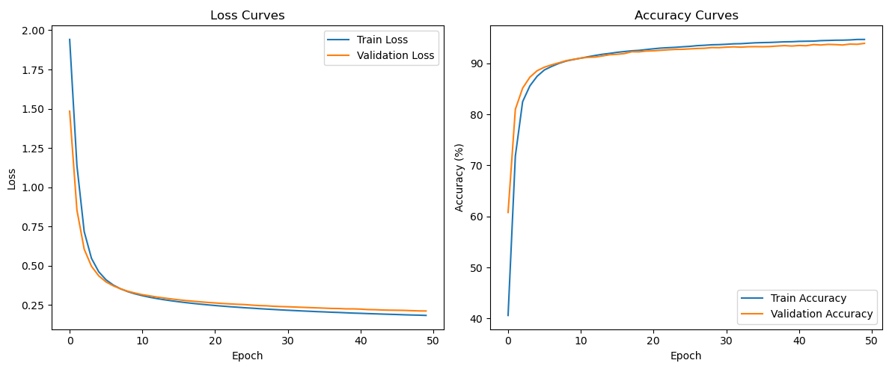

# MLP on MNIST Classification

This project implements a simple **Multi-Layer Perceptron (MLP)** using PyTorch to classify handwritten digits from the **MNIST** dataset.

## Model Architecture

The MLP used has the following structure:

- **Input layer**: 784 units (28x28 pixels)
- **Hidden layers**: 2 layers with 16 neurons each
- **Activation**: ReLU
- **Output layer**: 10 units (for digits 0–9)
- **Loss function**: CrossEntropyLoss
- **Optimizer**: Adam with learning rate `0.0001`

## Results

After training for **50 epochs** on MNIST, the model achieved:

- **Validation Accuracy**: ~94%
- **Test Accuracy**: **94.34%**
- **F1-Score**: Above 92% for all classes

The model shows no signs of overfitting, with validation loss and accuracy closely following the training curves.
