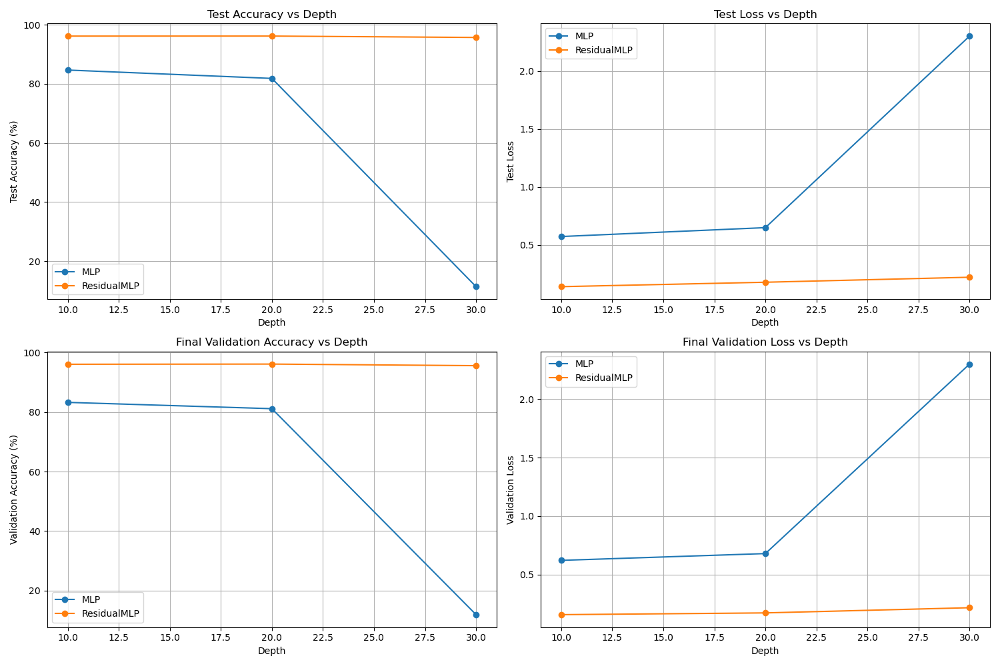
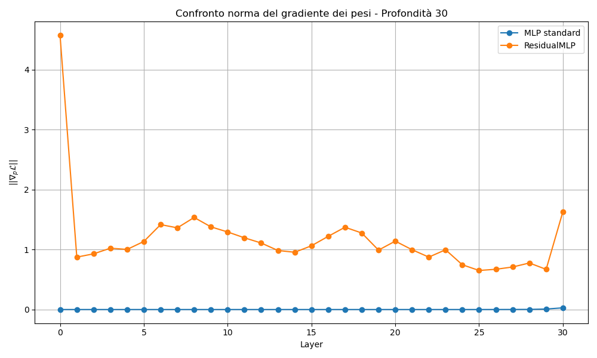

# Residual MLP vs Standard MLP on MNIST

This project compares a **standard Multi-Layer Perceptron (MLP)** with a custom **Residual MLP** architecture on the MNIST dataset. The goal is to evaluate how residual connections affect training dynamics, gradient flow, and model performance across different network depths.

The following setup was tested:
- **Depths tested:** 10, 20, 30 layers
- **Hidden size:** 32
- **Batch size:** 256
- **Epochs:** 50
- **Learning rate:** 0.0001
- **Optimizer:** Adam

## Output

### 1. Accuracy and Loss Trends by Depth

The following figure shows how increasing the depth affects test and validation performance for a standard MLP and a Residual MLP on the MNIST dataset:

- **MLP**: As the depth increases from 10 to 30, the performance **drastically drops**. At depth 30, the model collapses: test accuracy falls to ~10% (random guessing), and loss increases significantly.
- **ResidualMLP**: Maintains **consistently high accuracy (~96-97%)** and **low loss**, even at depth 30. This demonstrates the robustness of residual connections in deep architectures.

---

### 2. Gradient Norms – Depth 30

To further understand why deep MLPs fail, we examine the L2 norm of the gradients for each weight layer after one backward pass:

- **MLP standard (blue)**: Gradients are nearly zero across all layers — a clear case of **vanishing gradients**, preventing learning.
- **ResidualMLP (orange)**: Gradient norms are well-distributed and flow through the entire network, with visible peaks at the first and last layers (a typical pattern in residual architectures). This enables stable and effective training even at high depth.

---

### Conclusion

These results clearly illustrate that:

- **Standard MLPs are not scalable** to deeper networks due to vanishing gradients and optimization instability.
- **Residual connections** allow gradients to propagate efficiently, preserving performance and enabling deeper models to train effectively.
