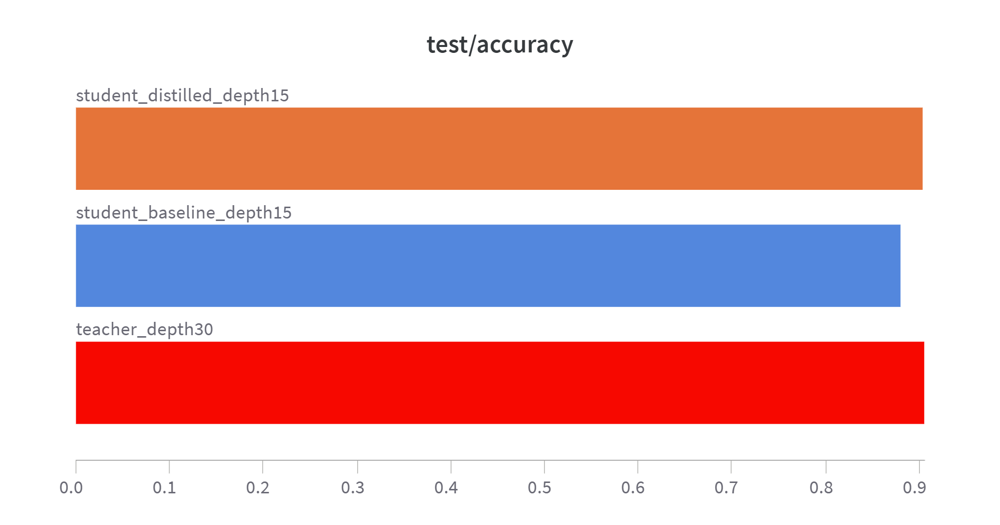
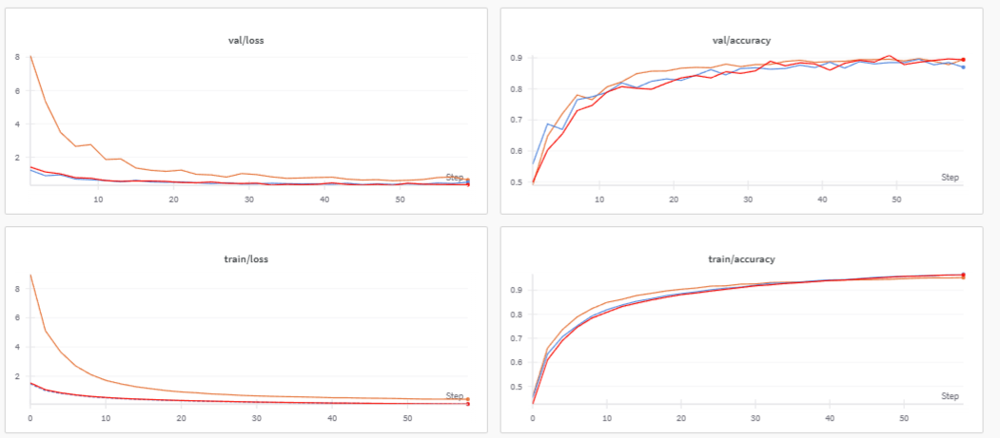

# Knowledge Distillation on CIFAR-10

This project implements knowledge distillation (Hinton et al., 2015) to compress a deep CNN model (teacher) into a smaller CNN model (student) on the CIFAR-10 dataset. The student is first trained using only hard labels and then re-trained using both hard and soft labels generated by the teacher.

## Goal

Train a smaller neural network (student) that mimics the performance of a larger model (teacher), leveraging:

- **Hard labels**: Ground-truth class labels from CIFAR-10.
- **Soft labels**: Probabilities output by the teacher model.

## Training Strategy

1. **Train the Teacher**  
   A deep model is trained on CIFAR-10 using standard cross-entropy loss.

2. **Train the Student (Baseline)**  
   A smaller model is trained on CIFAR-10 with only hard labels.

3. **Train the Student (Distilled)**  
   The same student model is re-trained using:
   - Cross-entropy loss on hard labels
   - KL divergence loss on soft labels from the teacher (with temperature `T = 4.0` and blending factor `α = 0.3`)

##  Final Results

| Model                      | Test Accuracy | Test Loss | Validation Accuracy | Validation Loss |
|---------------------------|---------------|-----------|---------------------|------------------|
| Teacher (depth=30)    | 0.9053     | 0.3595    | 0.894               | 0.3552           |
| Student (Baseline, d=15)  | 0.8907         | 0.4374    | 0.8852              | 0.4283           |
| Student (Distilled, d=15) | 0.9028         | 0.6728    | 0.8944         | 0.6332           |

 **Improvement from distillation**:  
- The distilled student not only surpasses the baseline student but almost reaches the teacher's performance — all while being significantly smaller in size.
- Compared to the baseline student, the distilled student improves by **+1.21%** in test accuracy.

> **Note**: The 1.21% improvement represents a meaningful gain in the context of CIFAR-10, where the dataset's relative simplicity naturally limits performance gaps between models of different sizes.

## Visualizations

This horizontal bar chart compares final **test accuracies** of:
- The **teacher** (depth=30)
- The **student baseline** (depth=15)
- The **student distilled** (depth=15)
  

The plots use the following color scheme:
- 🔴 **Red**: Teacher (depth=30)
- 🔵 **Blue**: Student Baseline (depth=15)
- 🟠 **Orange**: Student Distilled (depth=15)

**Key observations:**
-  The **distilled student**  shows significantly faster learning in the early epochs compared to the baseline.
-  In terms of **validation loss**, the distilled model consistently outperforms the baseline and closely approaches the teacher.
-  **Validation accuracy** of the distilled model almost matches the teacher while using **half the depth**.
-  All models converge similarly in training loss and accuracy, confirming proper optimization behavior.

## Conclusion:

Knowledge distillation proves to be a highly effective compression technique in this experiment. By transferring knowledge from a deep teacher network to a shallower student, we are able to:

- Achieve nearly **equivalent performance** to the teacher using a **much smaller model**.
- Gain over **1% improvement** in accuracy compared to the non-distilled student, demonstrating the benefit of soft targets.
- Preserve training stability and generalization while significantly reducing model complexity.

This validates the strength of distillation in resource-constrained environments where inference efficiency is critical.

## Reference

Hinton, G., Vinyals, O., & Dean, J. (2015). [Distilling the Knowledge in a Neural Network](https://arxiv.org/abs/1503.02531)

