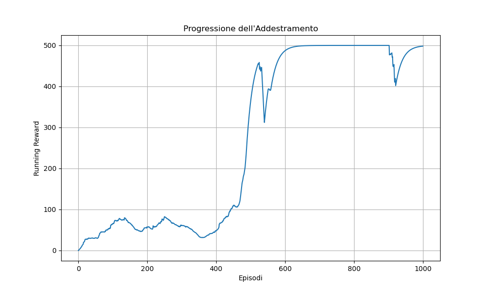

# CartPole-v1: REINFORCE Algorithm with PyTorch

This project implements a reinforcement learning agent using the **REINFORCE** policy gradient algorithm in the `CartPole-v1` environment from OpenAI Gymnasium. The codebase is fully modular and tracks training metrics via [Weights & Biases (wandb)](https://wandb.ai).

---

## Project Structure

- `main.py` — Runs training, evaluation, and visualizations
- `model.py` — Contains the policy neural network definition (`PolicyNet`)
- `reinforce.py` — Core logic for REINFORCE, evaluation, and logging
- `training_metrics_CartPole.png` — Example training performance plot

---
## Algorithm Summary

The REINFORCE algorithm optimizes a stochastic policy by maximizing the expected return using the gradient of the log-probability of actions. Each episode is used to estimate the return and update the policy accordingly.

- The agent samples actions from a softmax distribution over action logits.
- Returns are discounted and normalized to reduce gradient variance.
- Training uses `Adam` optimizer and episodic rollouts.
- Performance is evaluated every 50 episodes on 10 full evaluation runs.

---

## Training Results

The following plot shows the running reward over 1000 episodes of training:



### Observations:
- The agent starts with poor performance but rapidly improves.
- After ~500 episodes, it consistently reaches the maximum reward (500).
- Evaluation scores confirm stability and effectiveness of the learned policy.
- The model is checkpointed automatically when performance exceeds 450.

---

## How to Run

```bash
pip install -r requirements.txt
python main.py
