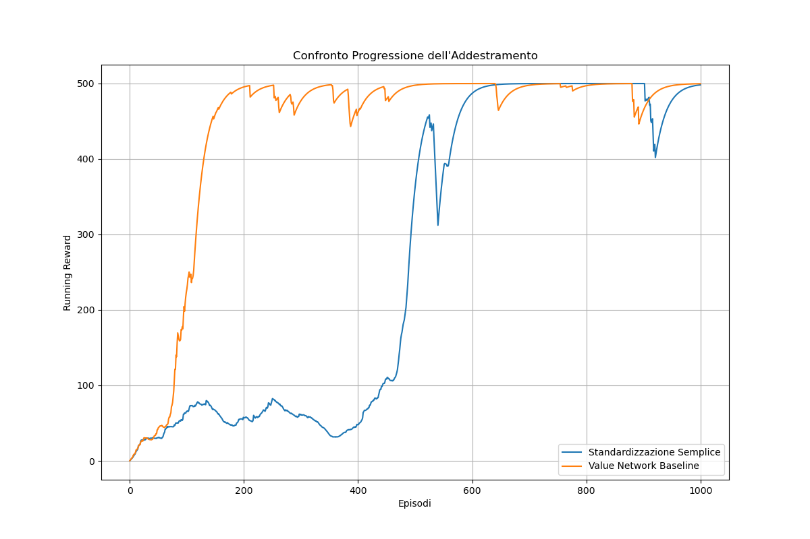

# Cartpole - REINFORCE with a Value Baseline

This project implements and compares two versions of the REINFORCE policy gradient algorithm on the CartPole-v1 environment:

1. **REINFORCE with simple reward normalization**
2. **REINFORCE with a learned value function baseline**

---

## Results

The chart below compares the learning curves of the two methods over 1000 training episodes.



- **Orange Line (Value Network Baseline)**: Shows faster and more stable convergence.
- **Blue Line (Simple Normalization)**: Learns eventually but is slower and more unstable at the start.

---
## Conclusion
Using a learned value baseline significantly improves training efficiency and convergence stability in REINFORCE. This experiment demonstrates the importance of variance reduction techniques in policy gradient methods.

---

## How to Run

To train both agents and produce the comparison plot:

```bash
python main.py
