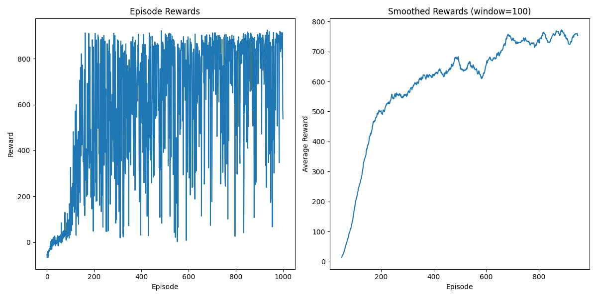

# Car Racing

This project applies deep reinforcement learning to a high-dimensional, continuous-control task by training a Proximal Policy Optimization (PPO) agent on Gymnasium’s CarRacing-v3 environment. The agent learns to interpret raw pixel inputs and output discrete driving commands, optimizing its policy to complete the track and maximize cumulative reward.

---

## Project Structure

```
ppo-carracing/
├── utils.py           # Environment wrapper, video recording, and utilities
├── ppo_agent.py       # PPO algorithm implementation (model, buffer, agent)
├── train.py           # Training and testing scripts
```


## Implementation Details

1. **Preprocessing & Environment Wrappers**

   - **CarRacingWrapper**:
     - Converts RGB frames to **grayscale** and resizes to **84×84**.
     - Stacks 4 consecutive frames along the channel dimension.
     - Uses frame-skipping (skip = 2) to reduce computational load.
     - Applies early termination when a sequence of negative rewards occurs, with an added penalty if the car is stuck.

2. **Actor-Critic Architecture**

   - **ActorCriticCNN**: a shared convolutional backbone with two heads:
     - **Actor**: outputs a discrete action distribution over 5 steering/throttle/brake combinations.
     - **Critic**: outputs a scalar state-value estimate.
   - Convolutional layers:
     1. 32 filters, 8×8 kernel, stride 4
     2. 64 filters, 4×4 kernel, stride 2
     3. 64 filters, 3×3 kernel, stride 1
   - Fully connected layer with 512 units before branching.

3. **Experience Buffer & GAE**

   - **RolloutBuffer** collects trajectories of length `rollout_steps` (2048).
   - Computes advantages using **Generalized Advantage Estimation** (λ=0.95).

4. **PPO Optimization**

   - Clipped policy objective (ε=0.2) and clipped value-loss (ε=0.2).
   - Entropy bonus (0.01) to encourage exploration.
   - **Adam** optimizer with a linearly decaying learning rate.

5. **Logging & Visualization**

   - Metrics tracked via **Weights & Biases (W&B)**: episode reward, 100-episode average reward, learning rate, total steps, evaluation results.
   - Saves `ppo_carracing_training.png` showing per-episode reward and smoothed reward (window=100).
   - Records a GIF .

---

## Training Results


### Learning Progression

| Phase | Episodes | Avg Reward | Description |
|-------|----------|------------|-------------|
| Initial | 1-50 | -30 to +30 | Random exploration, learning basic controls |
| Learning | 51-200 | +30 to +300 | Discovering track-following strategies |
| Optimization | 201-600 | +300 to +700 | Refining racing lines and speed control |
| Mastery | 601-1000 | +700 to +900 | Consistent high-performance driving |

### Training Curves




The training shows:
- **Left plot**: Raw episode rewards with high variance initially, stabilizing around episode 400
- **Right plot**: Smoothed rewards (100-episode window) showing clear learning progression
- Convergence to ~800-900 reward range indicating successful track completion

### Evaluation 
**Visualization of driving performance: ** [Agent eval](./eval.gif) 


The agent follows the racing line, corrects steering smoothly, and accelerates on straights.

### Final Test Results

```
Test Episode 1: Reward = 896.65, Steps = 468
Test Episode 2: Reward = 866.40, Steps = 500
Test Episode 3: Reward = 762.49, Steps = 500
Test Episode 4: Reward = 871.38, Steps = 500
Test Episode 5: Reward = 877.24, Steps = 500

Test Summary:
- Average Reward: 854.83 ± 47.30
- Max Reward: 896.65
- Min Reward: 762.49
```

---

## Conclusion

✅ **Successful Track Completion**: Agent consistently completes the full racing circuit  
✅ **High-Speed Navigation**: Maintains competitive lap times  
✅ **Robust Performance**: Low variance in test episodes  
✅ **Efficient Training**: Converges in 1000 episodes  

---

## Usage Instructions

1. **Install dependencies**

   ```bash
   pip install torch gymnasium wandb opencv-python imageio matplotlib
   ```

2. **Start training**

   ```bash
   python train.py 
   ```

3. **The test phase runs automatically after training**
 
---

## Acknowledgments

This implementation is based on the original PPO paper by Schulman et al. (2017) and adapted for the CarRacing environment with custom preprocessing and training optimizations.

**Note**: This project demonstrates the effectiveness of PPO for vision-based control tasks and serves as a foundation for more complex autonomous driving research.
