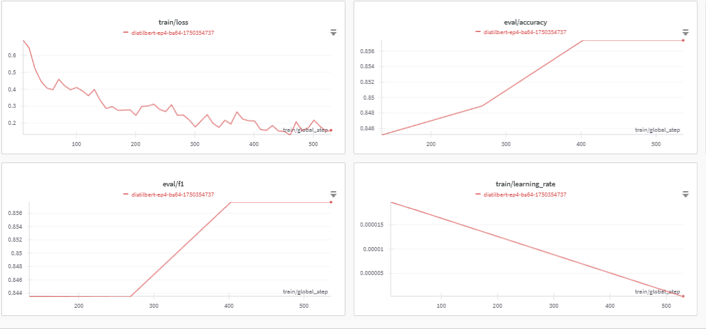

# Sentiment Analysis with HuggingFace Transformers

## Overview
This report summarizes the implementation and results of a sentiment analysis task using the HuggingFace Transformers ecosystem. The pipeline follows a structured approach from feature extraction to full model fine-tuning on the Rotten Tomatoes movie review dataset. To enhance user experience, the pipeline was made interactive through a simple command-line menu interface.

## Interactivity Enhancement
To support modular experimentation, a menu-based CLI was added with options to:

```bash
==================================================
SENTIMENT ANALYSIS PIPELINE - MENU
==================================================
1. Full pipeline (all exercises)
2. Baseline only (exercises 1.1–1.3)
3. Fine-tuning only (exercises 2.1–2.3)
4. Exit

Enter a number (1–4): 1

Running full pipeline...
```

This allows flexible control over individual pipeline stages.

## Exercise 1: Baseline Sentiment Analysis

### 1.1 Dataset and Pre-trained Model
We used the `cornell-movie-review-data/rotten_tomatoes` dataset with 8,530 training, 1,066 validation, and 1,066 test samples. The pre-trained model used was `distilbert/distilbert-base-uncased`.

### 1.2-1.3 Feature Extraction and SVM Baseline
We extracted features using the `[CLS]` token of DistilBERT via the HuggingFace feature-extraction pipeline. An SVM classifier was trained on these features.

**Baseline results:**
- **Validation Accuracy**: 82%
- **Test Accuracy**: 80%

##  Exercise 2: Fine-tuning DistilBERT

### 2.1 Tokenization
Tokenization was applied using `Dataset.map()` to generate `input_ids` and `attention_mask`, preparing the dataset for transformer input.

### 2.2 Model Setup
The `AutoModelForSequenceClassification` class was used to initialize DistilBERT with a classification head. Padding was handled with `DataCollatorWithPadding`.

### 2.3 Fine-tuning
Using `Trainer`, we fine-tuned the model with linear learning rate decay over 4 epochs and batch size of 64. `wandb` was integrated for real-time metric visualization.

**Fine-tuned Results:**
- **Validation Accuracy**: 85.7%
- **Validation F1-score**: 85.7%
- **Test Accuracy**: 83.9%
- **Test F1-score**: 83.7%

##  Key Metrics and Graphs




Visualizations tracked using Weights & Biases include:

1. **Training Loss**: Shows a consistent downward trend from ~0.69 to ~0.17, indicating the model is effectively minimizing error.
2. **Eval Accuracy**: Increases from ~84.8% to ~85.6%, showing consistent improvement and validating the effectiveness of fine-tuning.
3. **Learning Rate**: Linearly decays from 1e-5 down to ~4.4e-6, confirming that the scheduler operates as expected.
4. **Eval F1**: Closely mirrors accuracy, reaching a balanced and strong final value of ~0.856.

##  Conclusion

This lab illustrates the strength and modularity of the HuggingFace ecosystem and shows that with minimal setup, powerful models can be adapted to custom tasks efficiently.

## Setup & Execution

To run the project, follow these steps:

### 1. Install dependencies

Create a file called `requirements.txt` with the following content:

```txt
torch
transformers
datasets
scikit-learn
evaluate
numpy
tqdm
wandb
```

Then install all dependencies by running:

```bash
pip install -r requirements.txt
```

### Run the pipeline

After installing the dependencies, you can launch the interactive sentiment analysis pipeline with:

```bash
python main.py
```

