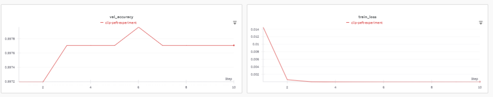

# Fine-Tuning CLIP on ImageNette with LoRA

## Overview

This project explores fine-tuning the CLIP model (`openai/clip-vit-base-patch16`) on the ImageNette dataset using a parameter-efficient method: **LoRA (Low-Rank Adaptation)**. The goal was to measure how much improvement can be obtained over CLIP's strong zero-shot performance.

---
## Project Structure

This repository fine-tunes a CLIP model using parameter-efficient LoRA techniques on the ImageNette dataset. The codebase is organized into modular components for clarity and maintainability.

```
clip-imagenette-finetuning/
├── dataset_utils.py       # Custom CLIP dataset and ImageNette class mapping
├── training_utils.py      # Training and zero-shot evaluation functions
├── main.py                # Main script for fine-tuning with LoRA
└── data/
    └── imagenette2/
        ├── train/         # Training dataset
        └── val/           # Validation dataset
```


## Setup

- **Model**: `openai/clip-vit-base-patch16`
- **Dataset**: ImageNette (10 classes, \~13,000 images)
- **Fine-Tuning Method**: LoRA (applied to both image and text encoders)
- **Training Epochs**: 10
- **Batch Size**: 32
- **Learning Rate**: 1e-4
---

## Dataset

The ImageNette dataset was automatically downloaded from the [ImageNette repository](https://github.com/fastai/imagenette) and extracted into the local `./data/imagenette2` folder. It contains:

- `train/`: \~9,500 images
- `val/`: \~3,000 images

---

## Zero-Shot Performance

Before fine-tuning, the CLIP model was evaluated in a zero-shot setting using class prompts like:

```
"a photo of a {class_name}"
```

**Zero-shot Accuracy**: **99.46%**

This confirms that CLIP already performs extremely well on ImageNet-like data.

---

## Fine-Tuning with LoRA

- LoRA was applied to both the vision and text transformer layers.
- Only **1.3% of the total model parameters** (\~1.97M out of \~151M) were updated.

### Training Dynamics:

- **Train Loss** quickly dropped to near-zero within 2 epochs.
- **Validation Accuracy** improved slightly, reaching a best of **99.80%** by epoch 6.

### Final Comparison:

| Metric                   | Value      |
| ------------------------ | ---------- |
| Zero-shot Accuracy       | 99.46%     |
| Best Fine-tuned Accuracy | **99.80%** |
| Improvement              | **+0.34%** |

---

## Per-Class Evaluation Metrics

| Class            | Precision | Recall | F1-score | Support |
|------------------|-----------|--------|----------|---------|
| tench            | 0.997     | 1.0    | 0.999    | 387     |
| English springer | 1.0       | 1.0    | 1.0      | 395     |
| cassette player  | 0.997     | 1.0    | 0.999    | 357     |
| chain saw        | 0.992     | 0.995  | 0.994    | 386     |
| church           | 1.0       | 1.0    | 1.0      | 409     |
| French horn      | 1.0       | 1.0    | 1.0      | 394     |
| garbage truck    | 0.995     | 0.997  | 0.996    | 389     |
| gas pump         | 0.995     | 0.99   | 0.993    | 419     |
| golf ball        | 1.0       | 0.997  | 0.999    | 399     |
| parachute        | 1.0       | 0.997  | 0.999    | 390     |

---

## Visual Summary

The training metrics were logged to Weights & Biases (wandb):



- `train_loss` showed rapid convergence.
- `val_accuracy` slightly increased then plateaued.


---

## Conclusion

This experiment demonstrates that:

- CLIP already performs extremely well on ImageNette in a zero-shot setting.
- A small fine-tuning effort using LoRA yields a measurable performance gain.


---
